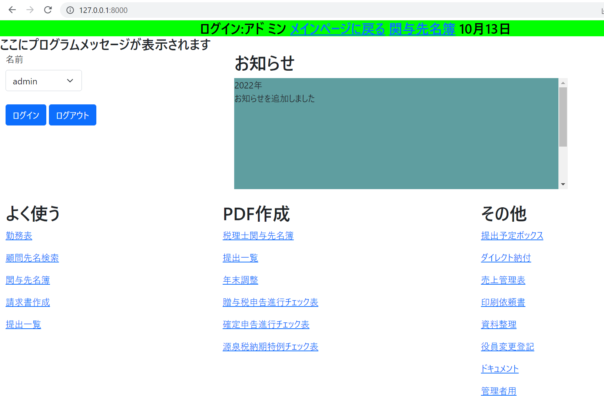
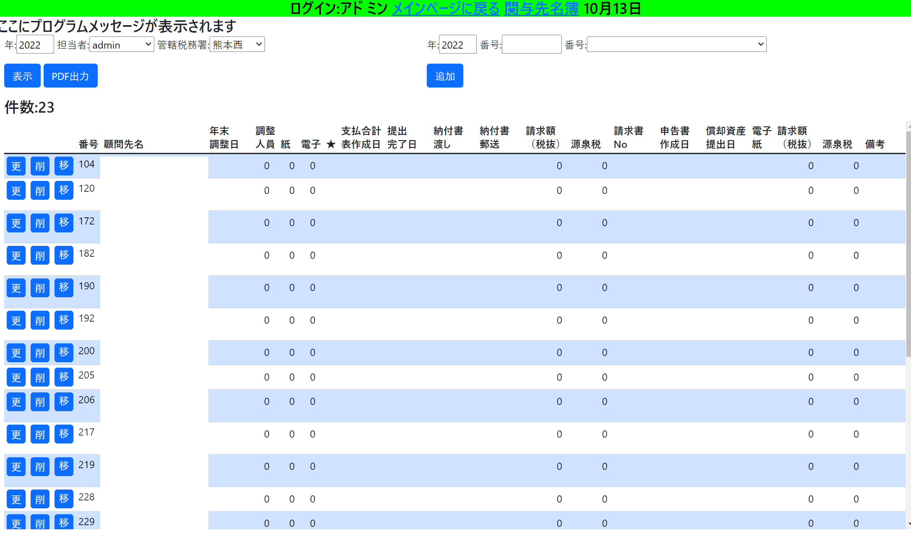

### サンプル

### インストール方法

git clone https://github.com/hikaru1444/diary.git

Python,PostgreSQL,requirements.txtにあるライブラリをインストール

diary/static/hideフォルダを作成

.envにある5つを変更する

    DB_HOST
    DB_NAME
    DB_USER
    DB_PASSWORD
    USER_PASSWORD (adminのパスワード)

migrateをした後にスーパーユーザー(admin)を作成

### プロジェクト構造(一部省略)
プロジェクト名とアプリ名が同じですので注意

diary/diary アプリ

    media PDFの保存先
    static cssやfavicon
    temlates
    views
    tests
    forms.py
    forms_choices.py　プルダウンメニューで使う
    models.py
    urls.py

diary/private_diary 設定ファイル

    settings.py
    urls.py

diary/project

    templatetag

diary/static 本番用

    hide ログの保存先

diary/templates

    404.html
    500.html

diary/manage.py他

